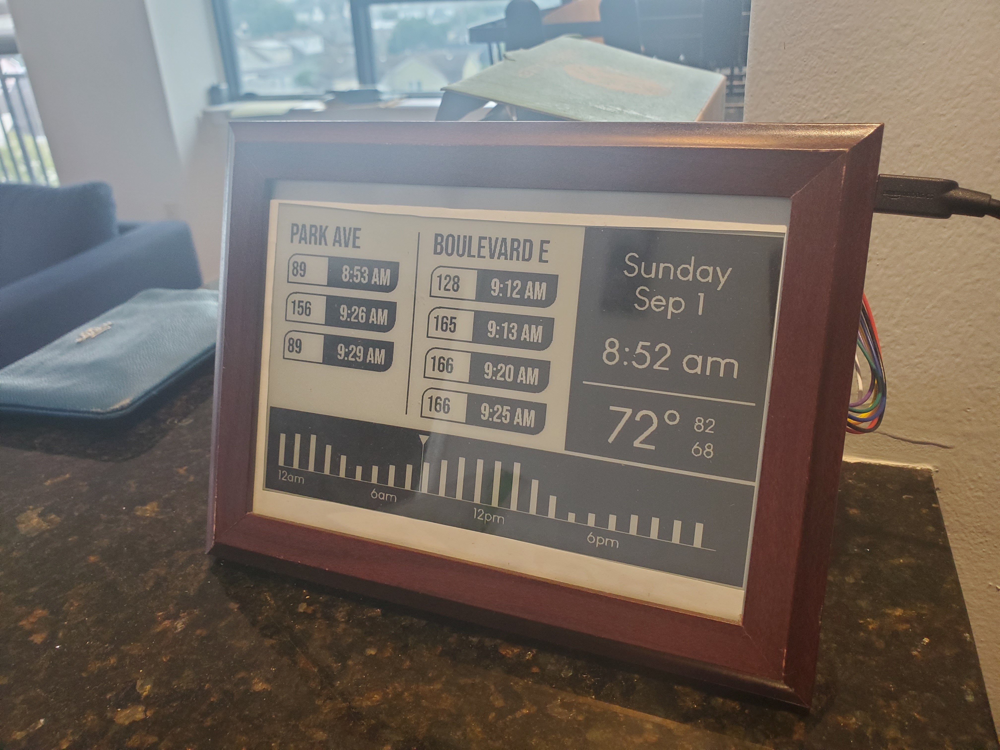

# Tinker

An internet-connected Arduino e-ink display

Tinker combines a Waveshare 7.5in 800x480 e-ink display and a backend server
to create a dashboard for time, weather, and bus arrival information.

## Details

For more information on how it works, view:

1. [the server README](tinker-worker/README.md)
2. [the Arduino's README](tinker-arduino/README.md)

## Example

